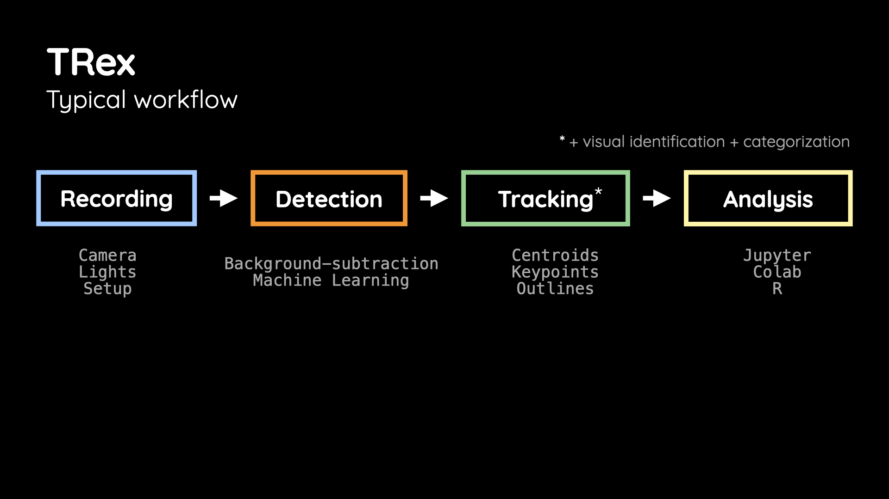
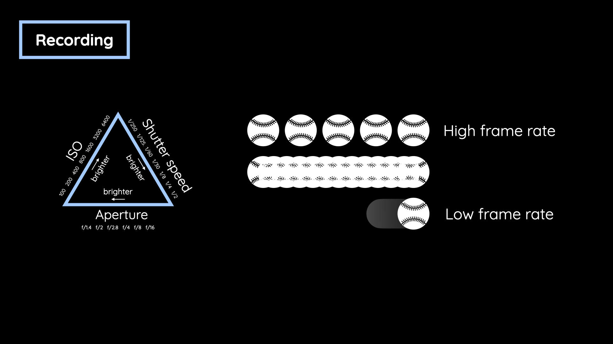
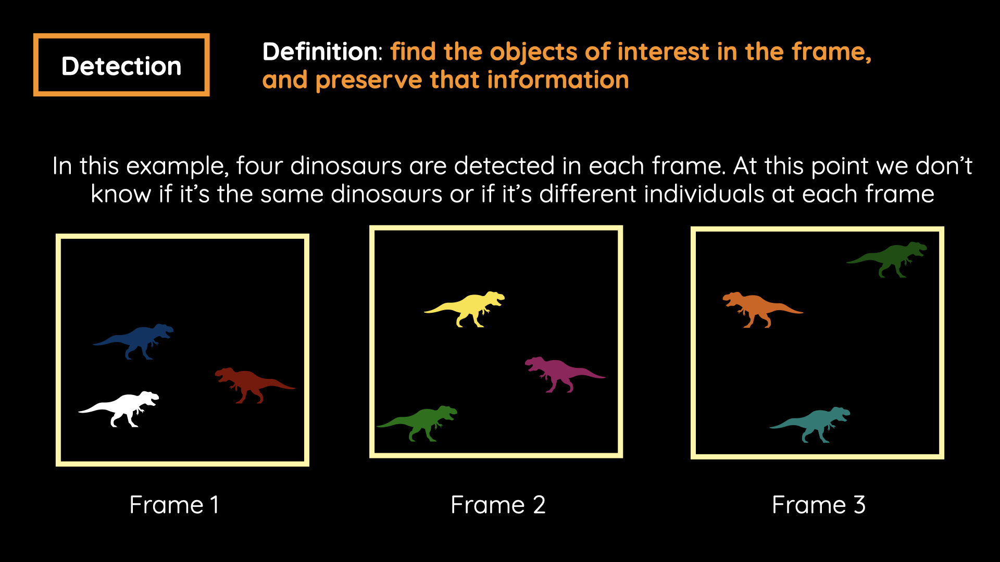
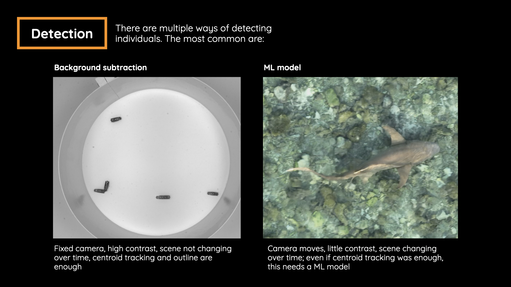
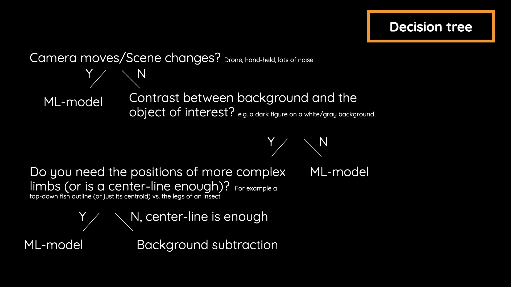
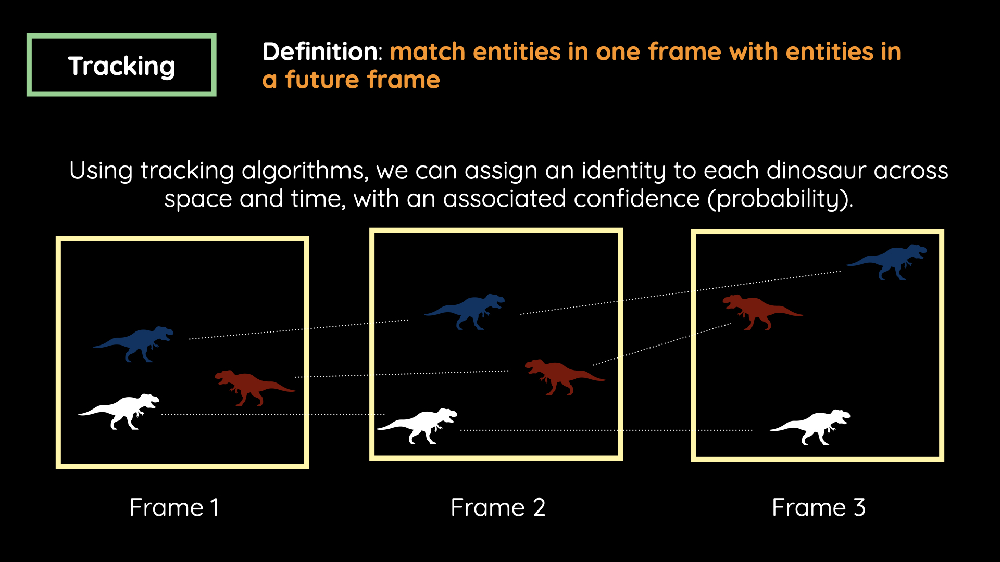

Introduction to Tracking with TRex
=============================================
If you are new to using TRex for object tracking, start here!
You probably have a specific use case in mind, videos to analyze, and objects to track. 
This guide will help you deciding on the best approach, whether you need to create a custom dataset, or not, and how to get started quickly.

The usual workfow is:

- Collect videos (Recording)
- Detect objects of interest in the videos (using a pre-trained model or background subtraction) (Detection)
- Track the detected objects across frames (Tracking)
- Analyze the tracking results (Analysis)

   The way to tracking: typical workflow.

1) Recording
--------------------------------------

Recording quality is the most important factor for good tracking data. 
We don't provide full recording support, but these guidelines help:

- Light: Use as much light as your system allows. If visible light is disruptive, consider infrared (IR) illumination.
- Camera: Dedicated computer-vision cameras (*e.g.*, Basler, Ximea) are ideal, but webcams, GoPros, DSLRs, or phones can work, depending on target size, speed, distance, and lighting.
- Settings help: Knowing aperture, frame rate, exposure time, and focus improves data quality. Frame rate for example is a trade-off: Higher fps captures fast motion but creates larger files.

Example: Walking locusts may be fine at ~10 fps, but you might miss a full jump. Choose fps based on the behaviors you need to resolve.

   Recording fundamentals: ISO, aperture, shutter speed, and frame rate.

.. |DetectionBlue| raw:: html

   Detection

2) Detection
--------------------------------------
After collecting a video, the next decision to take is how to detect your objects of interest (*e.g.* animals, robots, inanimate objects).
|DetectionBlue| means finding unidentified objects in each single frame of a video—the requirement for the next step: tracking them.

   Deteting objects of interest: the prerequisite for tracking.

In TRex, during the detection phase, the recorded video is converted into an optimized file format (.pv extension), which contains all necessary information for tracking.
There are multiple ways of detecting individuals. The most common are background subtraction and using a custom model.

.. raw:: html

   

     <article class="example-video">
       <h3>Detection preview in TRex</h3>
       <video controls autoplay muted loop playsinline preload="metadata" src="_static/gif_detection_gui.mp4"></video>
     </article>
   

For example if you have a static camera and a high contrast between the objects of interest and the background, background subtraction is a fast and easy way to detect objects.
If your video is more complex (moving camera, low contrast, changing background), a custom model is likely needed.

   Comparing two cases that require different methods: background subtraction vs. custom model.

In order to facilitate the decision, we provide a decision tree:

   Decision tree: choosing the right detection method.

Examples
=============================================

Here are three downloadable example videos showing different detection methods in TRex.
You can preview each one in the page before downloading the source video file.

.. raw:: html

   

     <article class="example-video">
       <h3>Background subtraction</h3>
       <video controls autoplay muted loop playsinline preload="metadata" src="_static/example_bsub_fish_web.mp4"></video>
       
MP4 video, 10.5 MiB

       <a class="example-video-download" href="_static/example_bsub_fish.mp4" download="example_bsub_fish.mp4" aria-label="Download example_bsub_fish.mp4">
         Download HD video (example_bsub_fish.mp4)
       </a>
     </article>
     <article class="example-video">
       <h3>Background subtraction + ML custom model</h3>
       <video controls autoplay muted loop playsinline preload="metadata" src="_static/example_ml_loc_web.mp4"></video>
       
MP4 video, 4.5 MiB

       <a class="example-video-download" href="_static/example_ml_loc.mp4" download="example_ml_loc.mp4" aria-label="Download example_ml_loc.mp4">
         Download HD video (example_ml_loc.mp4)
       </a>
     </article>
     <article class="example-video">
       <h3>ML custom model</h3>
       <video controls autoplay muted loop playsinline preload="metadata" src="_static/example_ml_shark_web.mp4"></video>
       
MP4 video, 28.6 MiB

       <a class="example-video-download" href="_static/example_ml_shark.mp4" download="example_ml_shark.mp4" aria-label="Download example_ml_shark.mp4">
         Download HD video (example_ml_shark.mp4)
       </a>
     </article>
   

.. |Trackinggr| raw:: html

   Tracking

3) Tracking
--------------------------------------

Once the objects of interest are detected in each frame, the next step is to track them across frames.
|TRackinggr| means entities in one frame with entities in a future frame.

   Tracking: keep the identity of the detected dinosaurs across frames.

Next steps
--------------------------------------

If a custom model is needed, continue to `Creating Annotations with TRex <2-create-annotations.rst>`_.
